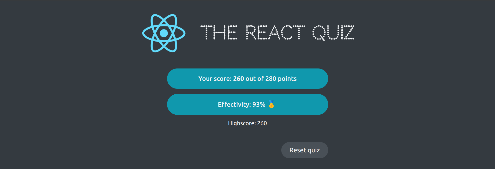

# React Quiz

## Table of Contents
- [Overview](#overview)
- [Built With](#built-with)
- [Features](#features)
- [Acknowledgements](#acknowledgements)

## Overview
- Simple app which consists of a React quiz.
- We built the application front-end and use a fake API (JSON server library) where to fetch the data from.
- It was built with React using Create React App.
- You can try it out at [Vercel - React Quiz](https://pop-corn-movies.vercel.app/)

### Built With
- useReducer
- JSON server library

## Features
- Very simple application, where users can test their React knowledge.

- The game present a question with four different options. 
- There is a progress bar at the top.
- The total points are shown at any time. 
- There is a limited amount of time to complete the quiz, so there is a timer on screen.
- If the selected answer if true, it is showed it in a different color than other options and the points panel get updated. 

- When the quiz is finished, the total points are displayed, showing the effectivity as well.

## Acknowledgements
This project is part of The Ultimate React Course 2023: React, Redux & More by [Jonas Schmedtmann](http://jonas.io/).